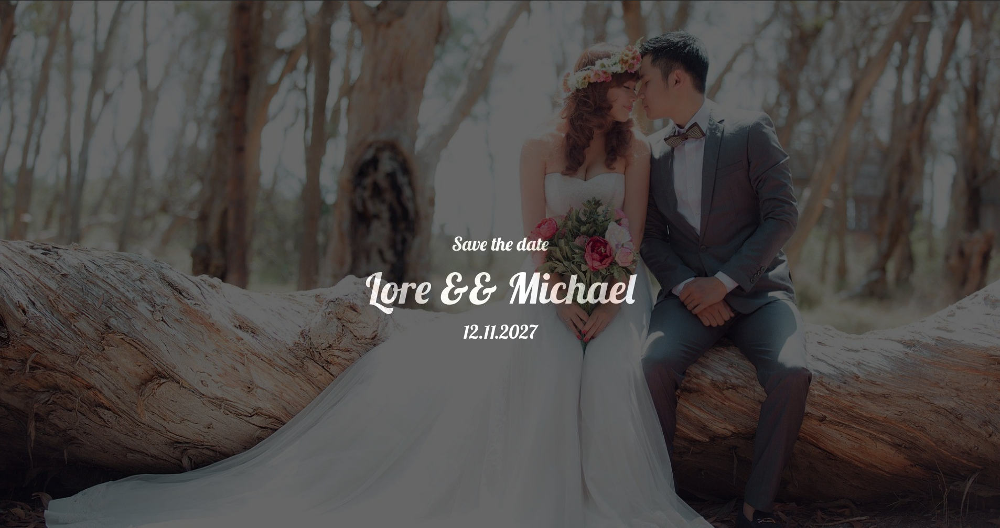

# WeddingInvitation

This project represents a wedding invitation app which contains a virtual
invitation as well as a confirmation system for the guests

## Backend

In the backend I have two main databases, the first one which is 
Authentication and authorization where an account for all guests will be
created manually by the wedding couple or an administrator. The MainView
database contains two tables, one which is called confirm_answers and another
one called guest_environment_details.

##### MAINVIEW

This database contains two tables, confirm_answers and guest_environment_details. This database
contains the whole mechanism of the app which is asking the guest after he's authenticated through a
form if he wants to come or not. That's a boolean question, it is only accept or refuse. That answer is
stored in a table where the couple or the app administrator can see through simple queries the people
who accepted, how many of them there are, the people who refused and others.
The table where this form information is stored is called confirm_answers. This table is automatically populated
after a guest is going to authenticate in the platform, the data from which is populated is stored in 
the user table from the authentication and authorization database where the app administrator is creating
an account for all guests. 

What the app administrator will see

How the form looks like for the guest who did not answered yet to the invitation

The default answer is no, so if you don't answer at all you will already have the negative answer
for the invitation.
In the moment the guest sends a positive answer to the invitation, the database will be automatically
updated and the interface will change.

What the app administrator will see

After the answer is sent, the guest_environment_details table comes in place. Here it's stored information
about where is the guest place, at what table and how the table looks like. This information is again
introduced manually by the administrator.

This is what the guest will see

## Frontend

In this page there are also images with the place where the wedding is organised, a map with the exact
position and others.

The project, like any other I've created, it's responsible, easy to access and use by almost any user.

 